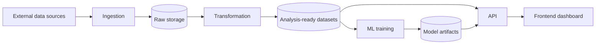

# Architecture

What the system is made of, how data moves through it, and what actually exists
today. **Update this in the same PR that changes the shape of the system** — a
component added, removed, or renamed; a change in how data flows between them;
or something moving from planned to built.

> **Status today: nothing is built yet beyond scaffolding.** The repo has an
> installable `housing` package, a test suite, and lint. Every component below
> is planned, and most of the technology choices are still open. This section is
> the honest answer to "how far along is this?" — see [STATE.md](STATE.md).

## Components

| Component | Purpose | Status |
| --- | --- | --- |
| Ingestion | Pull raw Colorado housing data from external sources on a schedule | Planned — source not chosen |
| Storage | Hold raw and analysis-ready datasets, versioned so a model run is reproducible | Planned — engine not chosen |
| Transformation | Clean, join, and reshape raw data into analysis-ready tables | Planned |
| ML training | Train and evaluate price/trend models; track runs and artifacts | Planned — framework not chosen |
| API | Serve predictions and aggregate statistics over HTTP | Planned — framework not chosen |
| Frontend | Dashboard that visualises the market and model output | Planned — framework not chosen |
| `housing` package | Python package all of the above will live in (`src/housing/`) | Built — skeleton only |

## Data flow

Every edge above is planned. Nothing in this diagram runs today.

Two properties this shape is meant to protect, worth stating before anything is
built against them: transformation reads from raw storage and never from the
source directly, so a re-run is reproducible without re-fetching; and the
frontend reads only through the API, never from storage, so there is one place
where "what the system knows" is defined.

## What's built today

- `src/housing/` — installable package (see [ADR 0001](docs/decisions/0001-src-layout.md)),
  currently just a version string
- `tests/` — pytest suite, currently a single import smoke test
- Tooling — ruff and pytest via uv (see [ADR 0002](docs/decisions/0002-ruff-rule-set.md))
- Automation — two GitHub Actions workflows that run Claude Code on `@claude`
  mentions and on pull requests; no application CI (tests/lint) yet

## Open questions

Each of these needs an [ADR](docs/DECISIONS.md) before the component it governs
is built:

- **Data sources** — which Colorado housing datasets, at what cadence, under
  what licensing and rate limits
- **Storage engine** — e.g. DuckDB vs Postgres vs flat Parquet; drives local
  development friction and how far the project can scale
- **Orchestration** — whether ingestion and transformation need a scheduler at
  all, or a cron-triggered script is enough to start
- **ML framework and experiment tracking** — how model runs and artifacts are
  recorded so a prediction can be traced to the data that produced it
- **API framework**
- **Frontend framework** — including whether it's a separate app or server-rendered

## See also

- [STATE.md](STATE.md) — current phase, what's in flight, what's next
- [docs/DECISIONS.md](docs/DECISIONS.md) — index of decision records
